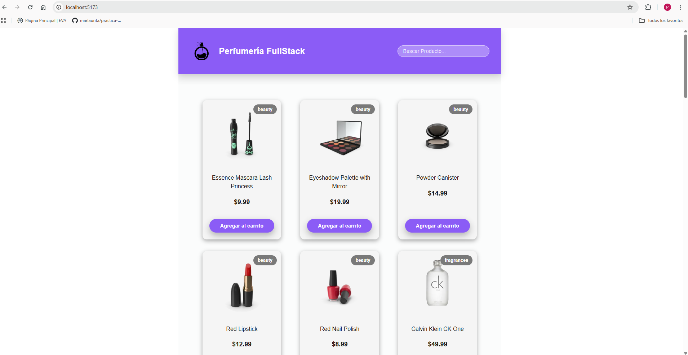
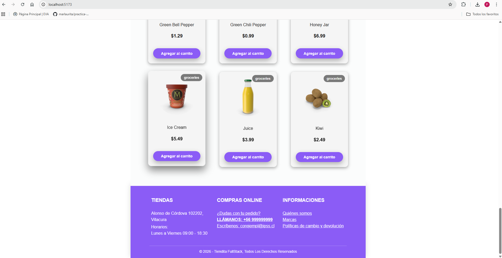
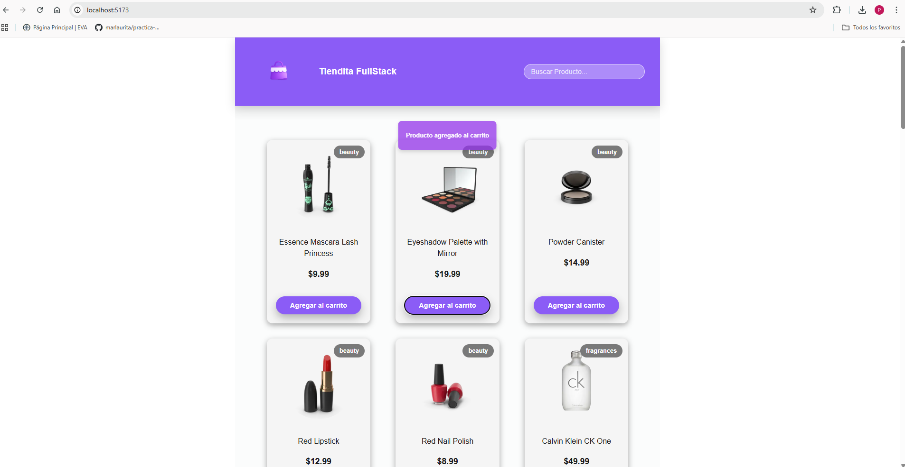
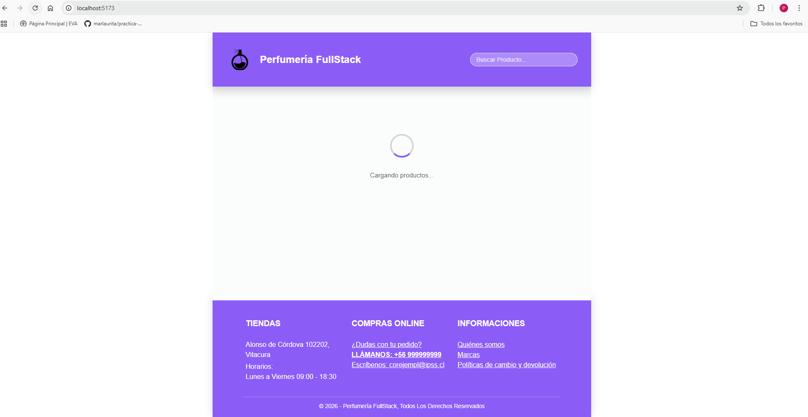

# Proyecto e-commerce React - Tarea 1 del módulo II - Diplomado FullStack (Paolo Stephano Andaur Fiabane)

## Nombre del proyecto

Perfumería FullStack.

## Descripción

Proyecto de e-commerce (perfumería) básico creado con React, enfocado en la creación de componentes reutilizables, los cuales se mencionan y explican brevemente a continuación.

## Componentes

- Header: Encabezado principal de la aplicación. Posee un logo, nombre de la tienda y una barra de búsqueda funcional, la cual permite filtrar el resultado de productos.
- SearchBar: Barra de búsqueda de productos.
- ProductList: Listado de productos. La obtención de los datos se realiza desde una API.
- ProductCard: Tarjeta individual de cada producto. Despliega información como una imagen, la categoría, nombre, precio y un botón para agregar al carrito (se emula) en caso de contar con stock. 
- CategoryLabel: Etiqueta visual según categoría del producto.
- ActionButton: Botón reutilizable que recibe un texto, evento 'onClick' y si está disponible o no (para habilitarlo o deshabilitarlo dependiendo del caso).
- EmptyState: Componente reutilizable al cual se le puede entregar información acerca de una búsqueda que no obtuvo resultados. Recibe un Icono, titulo y descripción del mensaje que se desea mostrar en el recuadro dentro de la página.
- ErrorMessage: Componente reutilizable que muestra un recuadro con un icono, mensaje de error y un botón funcional, el cual permite reintentar la carga fallida.
- Loader: Muestra un texto e icono de carga. Se utiliza asociado al estado de carga de la información de productos obtenida a través de la API.
- Footer: Pie de página de la aplicación. Contiene información básica de la tienda.

## Instrucciones para ejecutar el proyecto

1. Abrir consola
2. Situarse en la carpeta donde se dejará el repositorio, ej: cd C:\workspace
3. Clonar el repositorio: git clone https://github.com/andaurfiabane/tarea1-modulo-II.git
4. Ubicarse en el directorio: cd tarea1-modulo-II
5. Instalar dependencias: npm install
6. Ejecutar aplicación: npm run dev
7. Abrir el navegador: http://localhost:5173  para poder visualizar el proyecto (si no carga, ratificar el link en la consola donde se ejecutó npm run dev)

## Tecnologías utilizadas

- React
- Vite
- JavaScript
- CSS
- Git y GitHub

## Capturas de pantalla

**Vista general 1 del ecommerce (desktop) (cabecera con cuerpo).**

**Vista general 2 del ecommerce (desktop) (cuerpo y footer).**

**Vista al agregar un producto al carrito**

**Vista despliega solo 1 producto en un tamaño de pantalla más pequeño (mobile).**

**Vista ejecuta Loader.**

**Vista ejecuta mensaje de error tras no poder conectarse a la API.**
