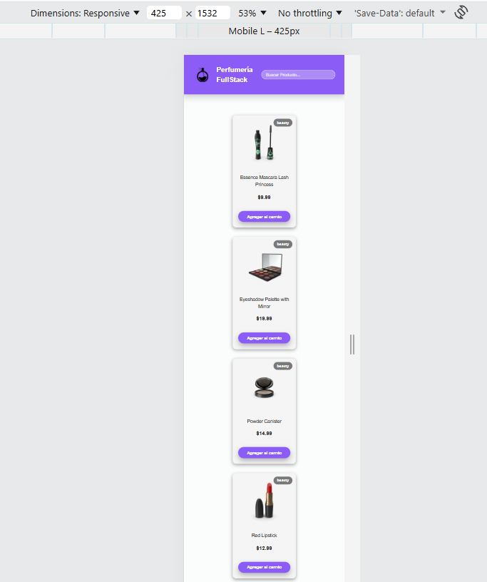

# Proyecto e-commerce React - Tarea 1 del módulo II - Diplomado FullStack (Paolo Stephano Andaur Fiabane)

## Nombre del proyecto

Perfumería FullStack.

## Descripción

Proyecto de e-commerce (perfumería) básico creado con React, enfocado en la creación de componentes reutilizables, los cuales se mencionan y explican brevemente a continuación.

## Componentes

- Header: Encabezado principal de la aplicación. Posee un logo, nombre de la tienda y una barra de búsqueda (la barra es solo visual).
- SearchBar: Barra de búsqueda de productos (por ahora es solo un componente que se visualiza, no ejecuta ninguna acción).
- ProductList: Listado de productos (por ahora se obtienen de un archivo JSON).
- ProductCard: Tarjeta individual de cada producto. Despliega información como una imagen, el género al cual está dirigido, nombre, precio y un botón para agregar al carrito (se emula por ahora) en caso de contar con stock. 
- GenderLabel: Etiqueta visual según categoría o género del producto. La etiqueta varía de color dependiendo del género.
- ActionButton: Botón reutilizable que recibe un texto, evento 'onClick' y si está disponible o no (para habilitarlo o deshabilitarlo dependiendo del caso).
- Footer: Pie de página de la aplicación. Contiene información básica de la tienda.

## Instrucciones para ejecutar el proyecto

1. Abrir consola
2. Situarse en la carpeta donde se dejará el repositorio, ej: cd C:\workspace
3. Clonar el repositorio: git clone https://github.com/andaurfiabane/tarea1-modulo-II.git
4. Ubicarse en el directorio: cd tarea1-modulo-II
5. Instalar dependencias: npm install
6. Ejecutar aplicación: npm run dev
7. Abrir el navegador: http://localhost:5173  para poder visualizar el proyecto (si no carga, ratificar el link en la consola donde se ejecutó npm run dev)

## Tecnologías utilizadas

- React
- Vite
- JavaScript
- CSS
- Git y GitHub

## Capturas de pantalla

**Vista general 1 del ecommerce (desktop) (cabecera con cuerpo).**

**Vista general 2 del ecommerce (desktop) (cuerpo y footer).**

**Vista al agregar un producto al carrito (manejo de estados).**

**Vista despliega solo 1 producto en un tamaño de pantalla más pequeño (mobile).**

